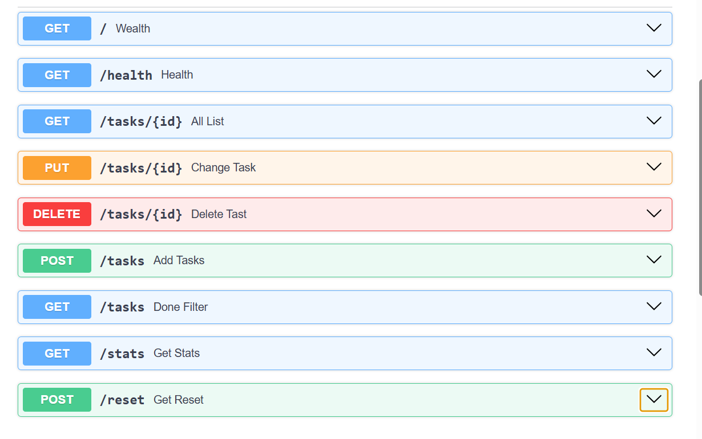

# Task API

A simple RESTful Task Management API built with **FastAPI**. This project demonstrates the implementation of CRUD (Create, Read, Update, Delete) operations using in-memory storage and Pydantic models for request validation.

## Features

- View all tasks
- Retrieve a task by ID
- Create a new task
- Update an existing task
- Delete a task
- Request validation using Pydantic
- Automatic interactive API documentation with Swagger UI

## Tech Stack

- Python 3.x
- FastAPI
- Pydantic
- Uvicorn

## Project Structure

```text
.
├── main.py              # Application entry point
├── ai-version/          # AI-generated implementation (Stage 7)
├── pyproject.toml       # Project dependencies
├── uv.lock              # Dependency lock file
├── README.md
└── .gitignore
```

## Installation

### Clone the repository

```bash
git clone <repository-url>
cd <repository-folder>
```

### Create a virtual environment

```bash
uv venv
```

### Activate the virtual environment

**Windows (PowerShell)**

```powershell
.venv\Scripts\Activate.ps1
```

**Windows (Command Prompt)**

```cmd
.venv\Scripts\activate.bat
```

### Install Dependencies

```bash
uv sync
```

or

```bash
uv add fastapi "uvicorn[standard]"
```

## Running the Application

```bash
uv run uvicorn main:app --reload
```

The server starts at:

```text
http://127.0.0.1:8000
```

## API Documentation

Swagger UI

```text
http://127.0.0.1:8000/docs
```

ReDoc

```text
http://127.0.0.1:8000/redoc
```

## Available Endpoints

| Method | Endpoint | Description |
|--------|----------|-------------|
| GET | `/` | API information |
| GET | `/health` | Health check |
| GET | `/tasks` | Retrieve all tasks |
| GET | `/tasks/{id}` | Retrieve a task by ID |
| POST | `/tasks` | Create a new task |
| PUT | `/tasks/{id}` | Update an existing task |
| DELETE | `/tasks/{id}` | Delete a task |
| GET | `/stats` | Retrieve task statistics *(Optional Extra)* |
| POST | `/reset` | Reset the task list to the initial sample data *(Optional Extra)* |

---

## Example Request

### Create a Task

```http
POST /tasks
```

Request Body

```json
{
  "title": "Complete FastAPI assignment"
}
```

Example Response

```json
{
  "id": 4,
  "title": "Complete FastAPI assignment",
  "done": false
}
```

---

## Example curl Output

```cmd
C:\Users\abc>curl -i -X POST http://127.0.0.1:8000/tasks ^
-H "Content-Type: application/json" ^
-d "{\"title\":\"Complete FastAPI assignment\"}"

HTTP/1.1 200 OK
date: Wed, 22 Jul 2026 06:27:50 GMT
server: uvicorn
content-length: 68
content-type: application/json

{"task":{"id":4,"title":"Complete FastAPI assignment","done":false}}
```

---

## Swagger UI


## Swagger UI




---

## Optional Extras

In addition to the required CRUD endpoints, the following optional features were implemented:

- **Task Statistics**

  ```
  GET /stats
  ```

  Returns:

  ```json
  {
    "total": 4,
    "done": 2,
    "open": 2
  }
  ```

- **Reset Tasks**

  ```
  POST /reset
  ```

  Restores the initial sample tasks for testing and demonstrations.

---

## Testing

The API can be tested using:

- Swagger UI
- curl
- Postman
- Insomnia

---

## Future Improvements

- Persistent database integration (PostgreSQL/SQLite)
- UUID-based task identifiers
- Input validation and custom error handling
- Pagination and filtering
- Authentication and authorization
- Unit and integration testing

---

# AI vs Me

## AI Prompt

```text
Paste the complete prompt you used to generate the AI implementation here.
```

## What did the AI do better — and do you understand its version well enough to explain it?

The AI produced a cleaner and more structured implementation. It used proper HTTP status codes, input validation, `HTTPException` for error handling, separate Pydantic models for creating and updating tasks, and organized the code with comments and endpoint descriptions. I understand its implementation and can explain how each endpoint, validation rule, and exception works.

## What did it get wrong or quietly ignore from your prompt?

The AI added several features that were not explicitly requested, including endpoint summaries, `Query`, `Field`, `HTTPException`, and a different project structure. It also changed the sample task data and response format instead of keeping them exactly as in my implementation.

## What did your prompt forget to specify — and what did the AI silently decide for you?

My prompt did not specify how the code should be organized, which HTTP status codes to use, how validation should be implemented, or how the initial task data should look. Because of this, the AI made those design decisions automatically by restructuring the project, adding validation, and improving documentation.

## Concrete Differences

- My implementation uses simple `for` loops, while the AI uses list comprehensions for filtering and searching.
- My code returns dictionaries for error responses, whereas the AI uses `HTTPException` with appropriate HTTP status codes.
- I created two Pydantic models (`newtask` and `changedtask`), while the AI created separate models (`Task`, `TaskCreate`, and `TaskUpdate`) with additional validation.
- The AI added endpoint summaries, comments, and cleaner code organization that were not present in my implementation.

---

## License

This project is intended for educational and learning purposes.