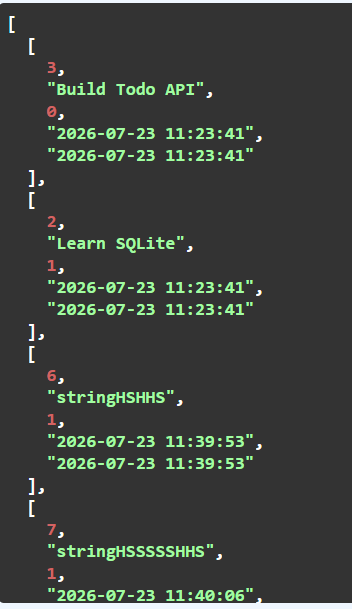
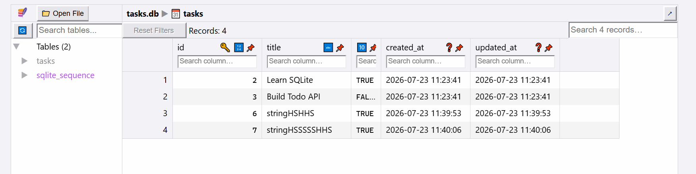

# TaskFlow API

<p align="center">
  <b>A production-style RESTful Task Management API built with FastAPI and SQLite</b>
</p>

<p align="center">
  A backend project demonstrating CRUD operations, API design, request validation, database persistence, and a clean separation between application logic and data storage.
</p>

<p align="center">


</p>

---

## Table of Contents

- [Overview](#overview)
- [Features](#features)
- [Tech Stack](#tech-stack)
- [Application Architecture](#application-architecture)
- [Project Structure](#project-structure)
- [Database Design](#database-design)
- [Installation](#installation)
- [Running the Application](#running-the-application)
- [API Endpoints](#api-endpoints)
- [API Examples](#api-examples)
- [SQL Queries Tested](#sql-queries-tested)
- [Optional Features Implemented](#optional-features-implemented)
- [Deployment & One-Command Setup](#deployment--one-command-setup)
- [Testing](#testing)
- [Key Backend Concepts Demonstrated](#key-backend-concepts-demonstrated)
- [Learning Outcomes](#learning-outcomes)
- [Future Improvements](#future-improvements)
- [Contributing](#contributing)
- [License](#license)
- [Author](#author)

---

## Overview

TaskFlow API is a backend REST API built with **FastAPI** that manages tasks through a complete set of CRUD operations.

The project originally stored tasks in an in-memory Python list. The storage layer was later upgraded to **SQLite**, so tasks persist across application restarts, and the project was further extended to support a **Dockerized PostgreSQL** backend for production-style deployment. Throughout these changes, the API contract stayed the same — only the underlying storage implementation changed.

This project illustrates a core backend principle:

> The API defines what the application does.
> The database defines where the application stores its data.

---

## Features

### Core Features

- Create new tasks
- Retrieve all tasks
- Retrieve a task by ID
- Update existing tasks
- Delete tasks
- Persistent SQLite database storage
- Automatic database initialization and table creation
- Sample data seeding on first run
- Request validation using Pydantic models
- Interactive Swagger API documentation

### Additional Features

- Health check endpoint
- Task statistics endpoint
- Endpoint for resetting test data
- Search and filtering via SQL queries
- Alphabetical task sorting
- PostgreSQL-backed persistent storage
- Environment variable configuration with `.env`
- Dockerized PostgreSQL database
- One-command startup with Docker Compose
- Repository pattern with an interchangeable storage layer
- SQL-based CRUD operations using Psycopg

---

## Tech Stack

| Technology | Usage |
|---|---|
| Python | Backend programming language |
| FastAPI | REST API framework |
| Pydantic | Data validation and schemas |
| Docker | Containerization platform |
| Docker Compose | Multi-container application orchestration |
| python-dotenv | Environment variable management |
| SQL | Database queries |
| Uvicorn | Application server |
| Swagger UI | API testing and documentation |

---

## Application Architecture

The application follows a simple layered backend structure:

```
                     Client
                       |
                       |
                HTTP Requests
                       |
                       |
                FastAPI Backend
                  (main.py)
                       |
                       |
          API Routes + Pydantic Models
                       |
                       |
             Database Access Layer
                (tasks.py)
                       |
                       |
                PostgreSQL Database
                       |
                       |
                Docker Container
```

### Before Database Integration

```
Client
  |
API
  |
Python List
```

Data was lost whenever the application restarted.

### After Database Integration

```
                Client
                  |
                  |
          HTTP Requests / Responses
                  |
                  |
          FastAPI Application
              (main.py)
                  |
                  |
          Route & Validation Layer
      (API Endpoints + Pydantic Models)
                  |
                  |
          Database Access Layer
              (tasks.py)
                  |
                  |
          SQLite Database
              (tasks.db)
```

Data now survives application restarts, persisted in the `tasks.db` file.

### Docker View

```
task-manager-api
│
├── API Container
│       |
│       └── FastAPI + Python
│
└── Database Container
        |
        └── PostgreSQL
            |
            └── Volume
                |
                └── Persistent Data
```

---

## Project Structure

```
TaskFlow2/
│
├── main.py
│   └── FastAPI routes and API logic
│
├── tasks.py
│   └── PostgreSQL database operations
│
├── images/
│   └── database.png
│
├── pyproject.toml
│   └── Project dependencies
│
├── .env                        # Local secrets (NOT committed)
├── .env.example                # Template for others
├── .gitignore                  # Ignores .env, venv, cache
├── uv.lock
│   └── Dependency lock file
│
├── requirements.txt            # Python dependencies
└── README.md
```

> **Note:** Screenshots referenced in the [Testing](#testing) section (`1.png`, `2.png`, `3.png`) should live in the `images/` folder alongside `database.png`. Keep this structure in sync with what's actually committed to the repo so the links don't break.

---

## Database Design

### Database Choice

PostgreSQL was selected as the production database because it:

- Is a powerful relational database system used in real-world backend applications
- Supports advanced SQL queries and reliable data management
- Offers better scalability than file-based databases
- Runs as an independent database server inside a Docker container
- Supports persistent storage through Docker volumes
- Integrates efficiently with FastAPI applications

### Database Technology

**Database:** PostgreSQL
**Deployment:** Docker container
**Connection:** Environment-based connection string (`DATABASE_URL`)

Example:

```
postgres://postgres:dev@db:5432/tasks
```

### Database Schema

The application uses a `tasks` table:

| Column | Type | Description |
|---|---|---|
| id | SERIAL PRIMARY KEY | Unique task identifier |
| title | TEXT | Task description |
| done | BOOLEAN | Completion status |

### Database Initialization

On application startup, the system automatically:

- Connects to PostgreSQL using the `DATABASE_URL` environment variable
- Creates the `tasks` table if it does not already exist
- Inserts initial sample tasks only when the table is empty
- Preserves existing data using a Docker volume

### Data Persistence

PostgreSQL data is stored using a Docker volume:

```
PostgreSQL Container
        |
        ↓
  Docker Volume
        |
        ↓
Persistent Task Data
```

This ensures tasks remain available even after stopping and restarting the Docker containers.

---

## Installation

### Clone the Repository

```bash
git clone <repository-url>
cd TaskFlow2
```

### Create a Virtual Environment

```bash
uv venv
```

Activate the environment:

**Windows**

```powershell
.venv\Scripts\Activate.ps1
```

**macOS / Linux**

```bash
source .venv/bin/activate
```

### Install Dependencies

```bash
uv sync
```

or:

```bash
uv add fastapi "uvicorn[standard]"
```

---

## Running the Application

Start the server:

```bash
uv run uvicorn main:app --reload
```

The application runs at:

```
http://127.0.0.1:8000
```

Swagger documentation:

```
http://127.0.0.1:8000/docs
```

ReDoc:

```
http://127.0.0.1:8000/redoc
```

---

## API Endpoints

| Method | Endpoint | Description | Success Code | Error Codes |
|-|-|-|-|-|
| GET | / | API information | 200 | — |
| GET | /health | Health check | 200 | — |
| GET | /tasks | Get all tasks | 200 | 422 (invalid query param) |
| GET | /tasks/{id} | Get task by ID | 200 | 404 (task not found) |
| POST | /tasks | Create task | 201 | 422 (validation error) |
| PUT | /tasks/{id} | Update task | 200 | 404 (task not found), 422 (validation error) |
| DELETE | /tasks/{id} | Delete task | 200 | 404 (task not found) |
| GET | /stats | Task statistics | 200 | — |
| POST | /reset | Reset tasks | 200 | — |

### Example Error Response

```json
{
  "detail": "Task with id 42 not found"
}
```

### Example Validation Error Response (422)

```json
{
  "detail": [
    {
      "loc": ["body", "title"],
      "msg": "field required",
      "type": "value_error.missing"
    }
  ]
}
```

---

## API Examples

### Create Task

**Request**

```
POST /tasks
```

Body:

```json
{
  "title": "Complete backend assignment"
}
```

**Response** (`201 Created`):

```json
{
  "id": 4,
  "title": "Complete backend assignment",
  "done": false
}
```

### Update Task

```
PUT /tasks/4
```

Body:

```json
{
  "title": "Complete SQLite integration",
  "done": true
}
```

Response: `200 OK`, or `404 Not Found` if the ID doesn't exist.

### Delete Task

```
DELETE /tasks/4
```

**Response** (`200 OK`):

```json
{
  "status": "Task deleted"
}
```

---

## SQL Queries Tested

**Fetch all tasks**

```sql
SELECT * FROM tasks;
```

**Fetch completed tasks**

```sql
SELECT *
FROM tasks
WHERE done = 1;
```

**Count tasks**

```sql
SELECT COUNT(*)
FROM tasks;
```

**Update tasks**

```sql
UPDATE tasks
SET done = 1;
```

**Delete completed tasks**

```sql
DELETE FROM tasks
WHERE done = 1;
```

---

## Optional Features Implemented

In addition to the core CRUD requirements, the following optional features have been implemented using SQL queries.

### 🔍 Search Tasks

Search tasks by title using SQL's `LIKE` operator.

**Endpoint**

```http
GET /tasks?search=milk
```

**Example**

```http
GET /tasks?search=learn
```

**SQL Query**

```sql
SELECT * FROM tasks
WHERE title LIKE '%learn%'
ORDER BY title ASC;
```

**Example Response**

```json
[
  {
    "id": 1,
    "title": "Learn FastAPI",
    "done": false,
    "created_at": "2026-07-23 15:10:20",
    "updated_at": "2026-07-23 15:10:20"
  }
]
```

### ✅ Filter Tasks by Completion Status

Retrieve only completed or pending tasks.

**Endpoint**

```http
GET /tasks?done=true
```

or

```http
GET /tasks?done=false
```

**SQL Query**

```sql
SELECT * FROM tasks
WHERE done = ?
ORDER BY title ASC;
```

**Example Response**

```json
[
  {
    "id": 2,
    "title": "Learn SQLite",
    "done": true
  }
]
```

### 🔤 Alphabetical Sorting

All task lists are automatically sorted alphabetically by title.

**SQL Query**

```sql
SELECT * FROM tasks
ORDER BY title ASC;
```

### 📊 Task Statistics

Retrieve summary statistics directly from SQLite using SQL aggregate functions.

**Endpoint**

```http
GET /stats
```

**SQL Queries**

```sql
SELECT COUNT(*) FROM tasks;
```

```sql
SELECT COUNT(*) FROM tasks
WHERE done = 1;
```

```sql
SELECT COUNT(*) FROM tasks
WHERE done = 0;
```

**Example Response**

```json
{
  "total": 8,
  "completed": 3,
  "pending": 5
}
```

### 🕒 Automatic Timestamps

Each task stores creation and last-updated timestamps.

**Database Schema**

```sql
created_at TIMESTAMP DEFAULT CURRENT_TIMESTAMP,
updated_at TIMESTAMP DEFAULT CURRENT_TIMESTAMP
```

**Update Query**

Whenever a task is updated, the `updated_at` column is refreshed automatically:

```sql
UPDATE tasks
SET
    title = %s,
    done = %s,
    updated_at = CURRENT_TIMESTAMP
WHERE id = %s;
```

### 💾 SQL Features Used

| Feature | SQL Statement |
|---------|---------------|
| Search | `LIKE` |
| Filtering | `WHERE` |
| Sorting | `ORDER BY` |
| Statistics | `COUNT(*)` |
| Insert | `INSERT INTO` |
| Update | `UPDATE` |
| Delete | `DELETE` |
| Retrieve | `SELECT` |
| Parameterized Queries | `?` placeholders |

### 📌 Sample API Requests

**Get all tasks**

```http
GET /tasks
```

**Search tasks**

```http
GET /tasks?search=sqlite
```

**Filter completed tasks**

```http
GET /tasks?done=true
```

**Filter pending tasks**

```http
GET /tasks?done=false
```

**Get task statistics**

```http
GET /stats
```

### 🚀 Key Improvements

- Persistent storage using SQLite
- SQL-based CRUD operations
- Parameterized queries to prevent SQL injection
- Search functionality using `LIKE`
- Filtering using SQL `WHERE`
- Automatic alphabetical sorting
- SQL aggregate functions (`COUNT`)
- Automatic timestamps (`created_at`, `updated_at`)
- Clean RESTful API built with FastAPI

### Database


*Accessed through Swagger UI*


*Accessed through SQL / DB Browser for SQLite*

---

## Testing

The API was tested using:

- Swagger UI
- curl
- Postman

### Swagger UI


### Sample curl Commands

```bash
# Get all tasks
curl -X GET http://127.0.0.1:8000/tasks

# Create a task
curl -X POST http://127.0.0.1:8000/tasks \
  -H "Content-Type: application/json" \
  -d '{"title": "Complete backend assignment"}'

# Update a task
curl -X PUT http://127.0.0.1:8000/tasks/4 \
  -H "Content-Type: application/json" \
  -d '{"title": "Complete SQLite integration", "done": true}'

# Delete a task
curl -X DELETE http://127.0.0.1:8000/tasks/4
```

### Persistence Testing

1. Created tasks through the API
2. Restarted the FastAPI server
3. Called `GET /tasks`
4. Verified the data remained available

---

## Key Backend Concepts Demonstrated

### API Layer

Responsible for:

- Receiving requests
- Validating input
- Returning responses

### Database Layer

Responsible for:

- Executing SQL queries
- Saving data
- Updating records

### Pydantic Models

Responsible for:

- Defining request schemas
- Enforcing type validation
- Handling data conversion

---

## Deployment & One-Command Setup

This project is designed so that any developer can clone the repository and run the complete application stack with a single command.

The stack includes:

- FastAPI backend application
- PostgreSQL database
- Docker containerization
- Docker Compose orchestration
- Persistent database storage using Docker volumes

### 1. Clone the Repository

```bash
git clone <repository-url>
cd task-manager-api
```

### 2. Configure Environment Variables

Create your local environment file from the provided template:

```bash
cp .env.example .env
```

The `.env` file contains the database connection configuration, for example:

```env
DATABASE_URL=postgres://postgres:dev@db:5432/tasks
```

⚠️ **Security Note:** The `.env` file contains sensitive configuration and is excluded from Git via `.gitignore`. Only `.env.example`, with placeholder values, is committed.

### 3. Run the Application

Start the complete backend stack:

```bash
docker compose up
```

Docker Compose automatically starts:

```
FastAPI Application Container
            |
            |
            ↓
PostgreSQL Database Container
```

The application then automatically:

- Starts the FastAPI server
- Connects to PostgreSQL
- Creates the `tasks` table if it does not exist
- Inserts initial seed tasks only when the database is empty
- Keeps data persistent using Docker volumes

### 4. Verify the API

Once the containers are running, test the API:

```bash
curl -i http://localhost:8000/tasks
```

Example response:

```http
HTTP/1.1 200 OK
Content-Type: application/json
```

```json
[
  {
    "id": 1,
    "title": "Learn FastAPI",
    "done": false
  },
  {
    "id": 2,
    "title": "Learn PostgreSQL",
    "done": false
  }
]
```

### 5. Verify the Database

The PostgreSQL database can be accessed inside the running container:

```bash
docker exec -it taskdb psql -U postgres -d tasks
```

View available tables:

```sql
\dt
```

Check stored task data:

```sql
SELECT * FROM tasks;
```

Example output:

```
 id | title              | done
----|--------------------|------
 1  | Learn FastAPI      | false
 2  | Learn PostgreSQL   | false
 3  | Build Task API     | false
```

### Clean Installation Test

The project was verified using a fresh environment:

```bash
cp .env.example .env
docker compose up
```

Expected result:

- ✅ Application starts successfully
- ✅ PostgreSQL connects automatically
- ✅ Database tables are created automatically
- ✅ Seed data is inserted only on first run
- ✅ API endpoints work without manual database setup
- ✅ Data remains available after restarting containers

### Database Screenshot

The PostgreSQL database state is captured below:

```
screenshots/postgres-data.png
```

The screenshot includes:

- PostgreSQL table listing (`\dt`)
- Task records from `SELECT * FROM tasks`
- Running database container verification

### Deployment Commit

Stage 5 completed:

```
Stage 5: One-command stack + documentation
```

The repository now allows any developer to clone, configure, and run the complete application stack using Docker Compose.

---

## Learning Outcomes

Through this project, I learned:

- Designing REST APIs with FastAPI
- Working with request bodies
- Using Pydantic schemas
- Performing SQL CRUD operations
- Connecting applications to databases
- Separating routes from database logic
- Understanding data persistence
- Writing professional backend documentation

---

## Future Improvements

Possible improvements include:

- Authentication and authorization
- Automated testing
- Database migrations
- Pagination
- Async database operations

---

## Contributing

This is a personal learning project built to practice backend engineering and API design. It's not currently set up to accept external contributions, but feedback, suggestions, and issue reports are welcome — feel free to open an issue if you spot a bug or have an idea for improvement.

---

## License

This project is licensed under the **MIT License**. See the [LICENSE](LICENSE) file for details.

You are free to use, copy, modify, and distribute this code for educational or personal purposes, provided the original copyright notice is retained.

---

## Author

**Rubab Fatima**
GitHub: [RubabFatima2](https://github.com/RubabFatima2)